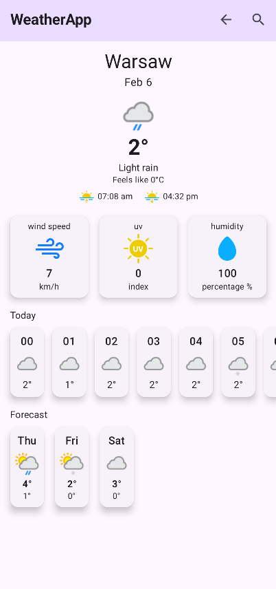

# WeatherApp (5th semester, late 2024)

WeatherApp is a modern mobile application built with **Android Studio** using **Jetpack Compose**.  
It enables users to track the weather in real time with a seamless and intuitive experience.

## Features

- 📍 **GPS Integration**: Get precise, location-based weather updates.
- 🌦️ **Real-time Weather Data**: Powered by the **OpenWeatherMap API**.
- ☁️ **Cloud Synchronization**: Sync user data across devices with **Firebase**.
- 👤 **User & Data Management**: Advanced features for handling user profiles and data securely. (in progress)

## Tech Stack

- **Android Studio**
- **Jetpack Compose**
- **OpenWeatherMap API**
- **Firebase**

